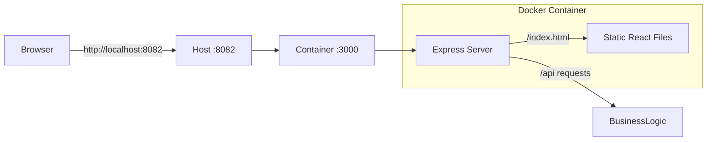

# E-commerce Application (Monolith Container)

This project contains a **Unified Container** that runs both the Node.js Backend and serves the React Frontend static files.

## Project Overview

- **Architecture**: Single Docker container.
- **Backend API**: Express.js (Port `3000` internal).
- **Frontend**: Served as static assets by Express at `/index.html` (or via client routing).
- **External Port**: `8082` (Mapped to `3000`).
  - *Note*: Port 8082 is used to avoid conflicts with Jenkins (default 8080).

## How to Run

### Prerequisite
Install [Docker](https://docs.docker.com/get-docker/) and [Docker Compose](https://docs.docker.com/compose/install/).

### Quick Start
1. Clone the repository.
2. Run:
   ```bash
   docker-compose up --build
   ```
3. Access:
   - **API Root**: [http://localhost:8082/](http://localhost:8082/) (Returns App Name/Port)
   - **Frontend**: [http://localhost:8082/index.html](http://localhost:8082/index.html)

## Architecture



## CI Pipeline
The pipeline builds a single image `e-commerce-app` from the root Dockerfile, verifies it, and pushes it to Docker Hub.

## Development with Docker
To run locally without Docker:
1. Build Frontend: `cd frontend && npm install && npm run build`
2. Prepare Backend: Copy `frontend/dist` to `backend/public`.
3. Run Backend: `cd backend && export PORT=3000 && npm start`.
